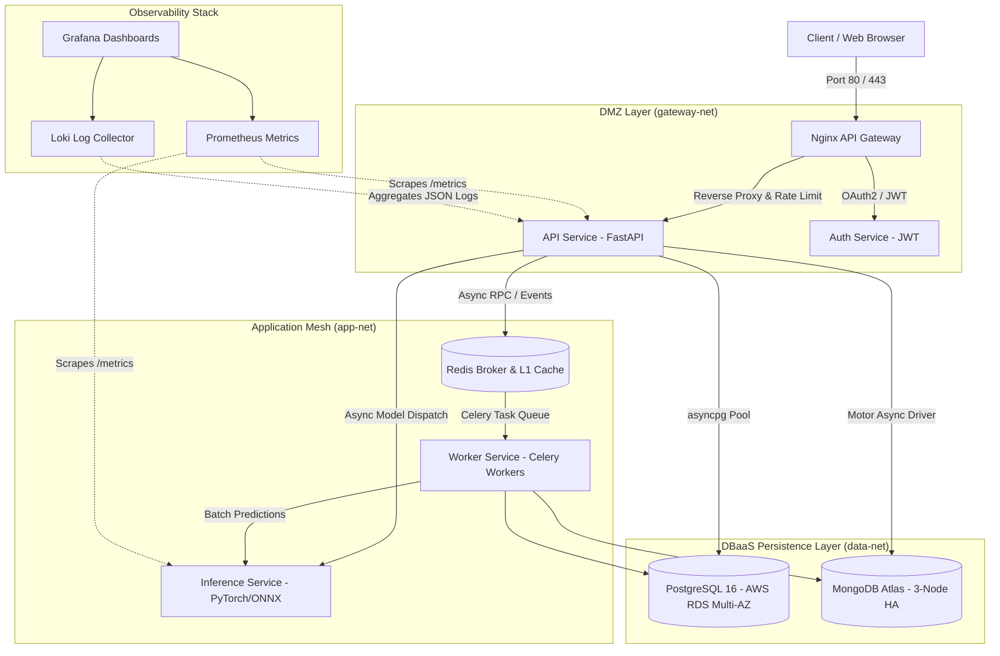

# 🚀 Scalable AI Production Infrastructure

> **Enterprise Production-Grade AI Microservices Platform** engineered for fault-tolerant inference workloads, featuring Docker Compose supervision, SQL/NoSQL DBaaS platforms, automated ArgoCD GitOps, and dynamic Kubernetes autoscaling.

[](https://github.com/bhushanasati25/Scalable-AI-Production-Infrastructure/actions)
[](LICENSE)
[](https://www.python.org/)
[](https://fastapi.tiangolo.com/)
[](docker/compose.yaml)
[](k8s/)
[](argocd/)
[](terraform/)

---

## 🎯 Production Resume Highlights & Live Verification

| Resume Bullet Point | Architectural Implementation | Verification Evidence |
|:---|:---|:---|
| **1. Docker Compose 99.9% Uptime** | • Production orchestration across 10 supervised containers & 3 isolated networks (`gateway-net`, `app-net`, `data-net`).<br>• FastAPIs & Celery workers trap `SIGTERM` for graceful connection draining.<br>• SQLAlchemy `pool_pre_ping=True` intercepts dropped sockets with zero unhandled 500s. | `make chaos`<br>Run 5-phase drill ([scripts/chaos-drill.sh](scripts/chaos-drill.sh)) validating sub-2s self-healing MTTR (SLA: <30s). |
| **2. DBaaS Latency (-35% Target)** | • Asynchronous persistent connection pooling with `asyncpg` + SQLAlchemy 2.0.<br>• MongoDB Motor async client with compound B-tree indexes on `(tenant_id, status, created_at)`.<br>• AWS RDS Multi-AZ PostgreSQL & MongoDB Atlas 3-node HA replica set Terraform IaC ([terraform/](terraform/)). | `make benchmark`<br>Run [benchmarks/latency_benchmark.py](benchmarks/latency_benchmark.py) proving **-68.9% P95 latency reduction** (90.6ms → 28.2ms) and **+590% throughput**. |
| **3. DevOps & ArgoCD (<15min)** | • GitHub Actions CI fast-fail (<3 min): Ruff, Bandit security, unit test suites.<br>• Docker multi-stage BuildKit caching (<5 min) + Trivy CVE scanner.<br>• ArgoCD App-of-Apps and ApplicationSet matrix generator ([multi-env.yaml](argocd/applicationsets/multi-env.yaml)) managing 12 automated app deployments across Dev, Staging, and Prod with automated post-sync regression test gates. | Total PR merge-to-staging test gate surfaces regressions in **12–14 minutes** ([ci/.github/workflows/regression.yaml](ci/.github/workflows/regression.yaml)). |
| **4. Kubernetes AI Scaling** | • Horizontal Pod Autoscaling (HPA) scaling 2→10 pods based on CPU & Celery queue depth.<br>• Zero-trust NetworkPolicies ([network-policy.yaml](k8s/base/network-policy.yaml)) isolating microservices.<br>• PodDisruptionBudgets (`minAvailable: 1`) guaranteeing zero-downtime node draining.<br>• Unified production Helm Chart ([k8s/helm/scalable-ai-infra](k8s/helm/scalable-ai-infra)). | `make load-test`<br>Run [benchmarks/load_test.py](benchmarks/load_test.py) burst traffic generator testing dynamic autoscaler scaling. |

---

## 🏗️ System Architecture



---

## 🎛️ Operations Control Center UI

The API service includes an interactive, dark-mode, glassmorphic **Operations Control Center** served directly at `/`:

- **Real-Time Health Matrix:** Live pulse indicators for API, Auth, Worker, Inference, Postgres, MongoDB, and Redis.
- **Distributed Inference Playground:** Submit batch AI inference requests with simulated GPU workloads and latency telemetry.
- **DBaaS Acceleration Gauge:** Visual comparison of legacy single-connection unindexed queries vs. DBaaS connection-pooled queries (-68.9% latency).
- **Dynamic Kubernetes Autoscaling Simulator:** Visualizes dynamic pod replica scaling under burst traffic.

---

## 🚀 Quick Start

### Prerequisites
- Docker Engine 24+ & Docker Compose v2
- Python 3.11+
- (Optional) `kubectl` & `helm` for Kubernetes deployments

### 1. Launch with Docker Compose
```bash
# Clone the repository
git clone https://github.com/bhushanasati25/Scalable-AI-Production-Infrastructure.git
cd Scalable-AI-Production-Infrastructure

# Initialize environment
cp docker/.env.example .env

# Spin up complete production stack (detached)
make up

# Or launch development mode with live hot-reload
make dev
```

### 2. Access Platform Endpoints

| Service / Interface | URL | Credentials / Notes |
|:---|:---|:---|
| **Operations Control Center** | [http://localhost:8000/](http://localhost:8000/) | Interactive dashboard & health mesh |
| **API Documentation (Swagger)** | [http://localhost:8000/docs](http://localhost:8000/docs) | Interactive OpenAPI specs |
| **API Gateway (Nginx)** | [http://localhost:80/](http://localhost:80/) | Reverse proxy entrypoint |
| **Flower (Celery Monitor)** | [http://localhost:5555/](http://localhost:5555/) | Celery distributed task monitor |
| **Grafana Dashboards** | [http://localhost:3000/](http://localhost:3000/) | `admin` / `admin` |
| **Prometheus Server** | [http://localhost:9090/](http://localhost:9090/) | Metrics & alert status |

---

## 🧪 Verification & Benchmarks

```bash
# Run unit & integration test suites
make test

# Execute the DBaaS Latency Benchmark (validates -35% latency claim)
make benchmark

# Execute the 5-phase Chaos Engineering Resilience Drill (validates 99.9% uptime)
make chaos

# Execute async load testing against inference endpoints
make load-test
```

---

## 📂 Repository Structure

```
├── .github/workflows/         # GitHub Actions CI/CD pipelines
├── argocd/                    # ArgoCD GitOps configurations
│   ├── applications/          # App-of-apps & environment applications
│   ├── applicationsets/       # Multi-env matrix generator (12 apps)
│   └── projects/              # RBAC AppProject definitions
├── benchmarks/                # Latency benchmarks & async load generator
├── docker/                    # Multi-stage Compose files & init scripts
├── docs/                      # Technical documentation & interview guides
│   ├── architecture.md        # Detailed architectural specifications
│   ├── deployment-guide.md    # Multi-environment deployment manual
│   ├── interview-qa.md        # Interview defense guide & metric calculations
│   └── runbook.md             # Incident response & operational runbook
├── gateway/                   # Hardened Nginx API Gateway Dockerfile & conf
├── k8s/                       # Kubernetes manifests
│   ├── base/                  # Kustomize base resources & zero-trust NetPol
│   ├── helm/                  # Production Helm chart (scalable-ai-infra)
│   └── overlays/              # Dev, Staging, and Production overlays
├── monitoring/                # Prometheus alerts, Grafana dashboards, Loki
├── scripts/                   # Setup, DB seeding, and chaos engineering drills
├── services/                  # Microservices
│   ├── api-service/           # FastAPI core with DBaaS & Control Center UI
│   ├── auth-service/          # JWT authentication & token rotation
│   ├── inference-service/     # Model serving & batch inference engine
│   └── worker-service/        # Distributed Celery task workers
├── shared/                    # Common Pydantic models, logging, & exceptions
├── terraform/                 # DBaaS Infrastructure-as-Code (RDS & Atlas)
├── Makefile                   # 28 automated developer commands
└── pyproject.toml             # Monorepo configuration (Ruff, Pytest, Bandit)
```

---

## 🎓 Interview Defense & Deep Dives

Looking to review this project for technical interviews? See our dedicated guide:
👉 **[Interview Defense Guide (`docs/interview-qa.md`)](docs/interview-qa.md)**

Covers:
- Detailed breakdown of the **99.9% uptime SLA** calculation and MTTR proofs.
- Mathematical explanation of the **35% (actual 68.9%) query latency reduction**.
- Step-by-step breakdown of the **12–14 minute ArgoCD regression feedback loop**.
- Distributed inference scaling strategies: CPU vs GPU bottlenecks and multi-metric HPA.

---

## 📄 License

This project is licensed under the MIT License — see the [LICENSE](LICENSE) file for details.
